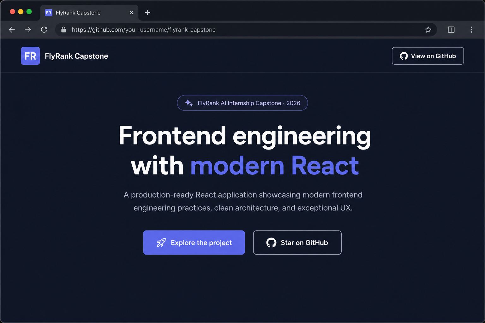

# FlyRank AI Internship Capstone Project

[](https://github.com/GitWithEkam/flyrank-ai-internship-capstone-project/actions/workflows/ci.yml)
[](./LICENSE)
[](https://nodejs.org/)

A frontend capstone project developed during the **FlyRank AI Frontend Engineering Internship**. The goal is to build a production-quality React application using modern tooling and AI-assisted development workflows.



---

## Table of Contents

- [About](#about)
- [Tech Stack](#tech-stack)
- [Prerequisites](#prerequisites)
- [Getting Started](#getting-started)
- [Available Scripts](#available-scripts)
- [Project Structure](#project-structure)
- [Development Guidelines](#development-guidelines)
- [Environment Variables](#environment-variables)
- [Roadmap](#roadmap)
- [Contributing](#contributing)
- [License](#license)
- [Author](#author)

---

## About

This repository documents my work throughout the FlyRank AI internship capstone. It focuses on:

- Building responsive, accessible UI with React and TypeScript
- Following component-driven architecture and clean code practices
- Using AI tools effectively while maintaining code quality and ownership

The application includes a landing page with feature highlights, tech stack overview, and a live development roadmap.

---

## Tech Stack

| Category        | Technology      |
| --------------- | --------------- |
| Framework       | React 19        |
| Build Tool      | Vite 6          |
| Language        | TypeScript 5.8  |
| Styling         | Tailwind CSS 4  |
| Linting         | ESLint 9        |
| CI              | GitHub Actions  |

---

## Prerequisites

Ensure the following are installed before running the project locally:

- **Node.js** — v18 or later ([Download](https://nodejs.org/))
- **npm** — included with Node.js (or use **pnpm** / **yarn** if preferred)

Verify your setup:

```bash
node -v
npm -v
```

---

## Getting Started

### 1. Clone the repository

```bash
git clone https://github.com/GitWithEkam/flyrank-ai-internship-capstone-project.git
cd flyrank-ai-internship-capstone-project
```

### 2. Install dependencies

```bash
npm install
```

### 3. Start the development server

```bash
npm run dev
```

Open [http://localhost:5173](http://localhost:5173) in your browser. Vite will hot-reload as you edit files.

### 4. Build for production

```bash
npm run build
```

Preview the production build locally:

```bash
npm run preview
```

---

## Available Scripts

| Command           | Description                              |
| ----------------- | ---------------------------------------- |
| `npm run dev`     | Start the Vite dev server with HMR       |
| `npm run build`   | Type-check and bundle for production     |
| `npm run preview` | Serve the production build locally       |
| `npm run lint`    | Run ESLint across the project            |

---

## Project Structure

```
├── .github/workflows/   # CI pipeline (lint + build)
├── docs/                # Documentation assets (screenshots)
├── public/              # Static assets
├── src/
│   ├── components/      # Reusable UI components
│   ├── App.tsx          # Root application component
│   ├── index.css        # Global styles + Tailwind theme
│   └── main.tsx         # Application entry point
├── .env.example         # Environment variable template
├── CONTRIBUTING.md      # Contribution guidelines
├── index.html
├── vite.config.ts
├── tsconfig.json
└── package.json
```

---

## Development Guidelines

This project follows standard React best practices:

- Functional components with hooks
- Modular, reusable components
- Responsive, mobile-first design
- Readable, maintainable code over premature abstraction

Additional AI and coding conventions are documented in [`CLAUDE.md`](./CLAUDE.md).

---

## Environment Variables

Copy the example file and fill in values as needed:

```bash
cp .env.example .env
```

```env
VITE_API_BASE_URL=
```

> Variables exposed to the client must be prefixed with `VITE_` in Vite projects. The `.env` file is gitignored and must not be committed.

---

## Roadmap

- [x] Initialize Vite + React + TypeScript scaffold
- [x] Add Tailwind CSS and base design tokens
- [x] Implement core UI components and layout
- [ ] Add routing and page structure
- [x] Configure ESLint and CI pipeline
- [ ] Deploy to production (TBD)

---

## Contributing

Contributions are welcome! Please read [`CONTRIBUTING.md`](./CONTRIBUTING.md) for setup instructions, code standards, and pull request guidelines.

Quick summary:

1. Fork the repo and create a feature branch
2. Make your changes and run `npm run lint && npm run build`
3. Open a Pull Request against `main`

---

## License

This project is licensed under the [MIT License](./LICENSE).

---

## Author

**Ekamnoor Singh**

FlyRank AI — Frontend Engineering Internship Capstone (2026)
